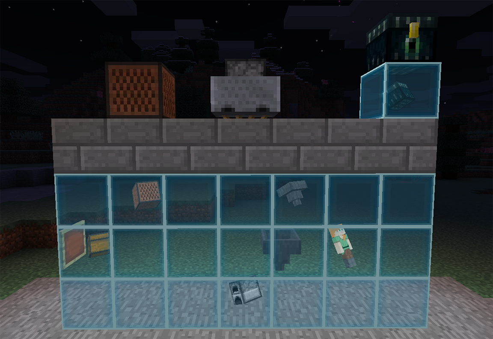
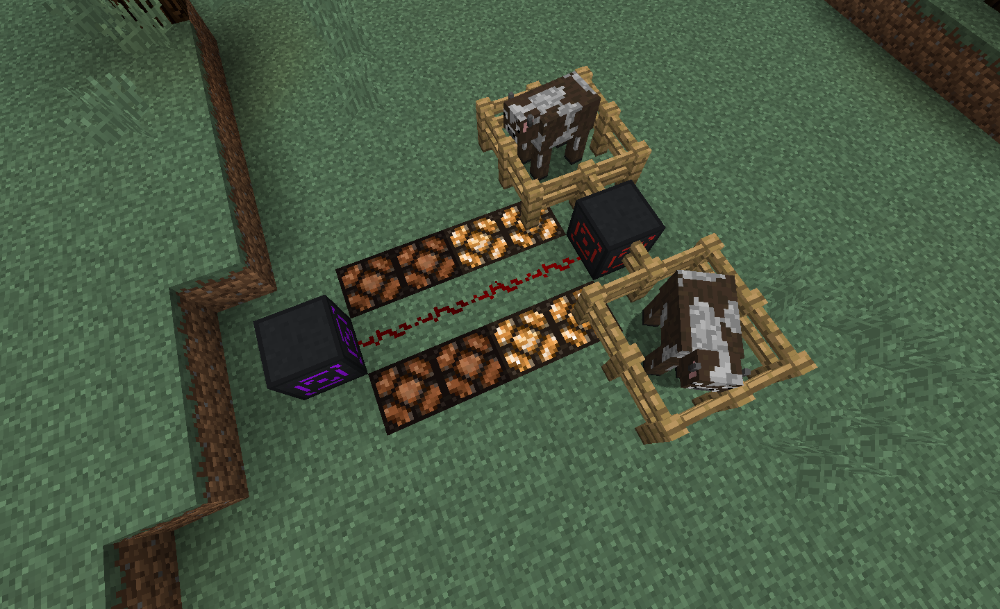

# Utilitas

## Contents

### vanilla tweaks
- Option to disable the ender pearl fall damage

### Universal Interface

An overpowered wireless interface (like the transvector interface from Thaumic Tinkerer) which can be linked to almost anything that has an inventory.
If officially supports the following:

- Any IInventory.
- Any IFluidHandler.
- Players (works if the player is offline).
- Ender Chests (place one above the interface and link a player to it, works if the player is offline).
- Item Frames.
- [Jukeboxes](https://www.youtube.com/watch?v=8QA4jiS7jzI) (they're not IInventories).
- Minecarts containers (chest & hopper in vanilla).
- Minecart furnaces.

Support for more can be added by other mods through IMC.  
Support for Cauldrons (as IFluidHandlers), flower pots, and Armor Stands is planned.

### Proximity Sensor

Emit a redstone signal equal to the amount of entities withing the detection radius of the block.

You can filter what kind of entities will be detected using the link wand.  
The radius can be changed by right clicking (+) and sneak right clicking (-) the block.

### Reconditioner

The mending enchantment, as a machine.

Craft it, place a mending book and your damaged item in it, add some XP and energy (or mana), and voilà! They are good as new.

### Slime Staff

[Video](https://www.youtube.com/watch?v=9mY3nxlV1b4)

Right click on a slime to catch it in your slime staff.

Each slime type has its own specificity.

- Regular slimes will pick up and give you nearby dropped items.
- Ender slimes will do the same but like teleporting around.
- Magma slimes like to attack anything that moves.

Slime familiars follow their owner around, although you can place them on slimepads to
make them stay near it.

Slimes that pick up items can be placed on inventories (like a chest), 
they will try to put the items in them.

### Rainbow Slimes

They're like regular slimes, but pretty! They spawn when slimes spawn in the rain.

## Planned Features

### Fluid Hopper

A hopper, for fluids. It

- Drains fluid blocks placed above it
- Drains tanks placed above it (entities & blocks)
- Fills tanks it points to (entities & blocks. Time to make a minecart tank!)

### Fluid Diffuser

Applies the effects of fluids to nearby players.

- Piping potions will apply the potion effect.
- Piping fluids will apply the fluid effect.

### Handheld Fluid Diffuser

Same as the fluid diffuser but using fluid tanks and potions present in the inventory.

It will not use instant potions (like instant health) nor splash or lingering potions.

### Other

- Fluid Tank Minecart
- Fluid Hopper Minecart
- Auto-feeder
- Enhanced Comparator

## Modpacks

You are allowed to use this mod in any modpack. 
